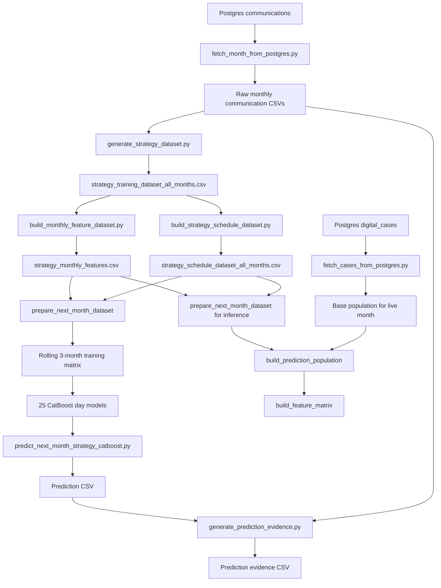

# Recommendation Model End-to-End Data Flow

## System Overview

This document explains the end-to-end lifecycle of the campaign recommendation model implemented in this repository, from raw Postgres extraction to final recommendation output.

The objective of the system is:

- take historical customer communication behavior
- convert it into structured behavioral signals
- learn which channel, hour, and language worked best on each EMI-relative day
- predict the best next action for the next EMI cycle

This is not a collaborative-filtering recommender. It is a **supervised, multi-class next-best-strategy prediction system**.

For each account and each campaign day, the model predicts a label such as:

- `SMS-4PM-ENGLISH`
- `WH-12PM-ENGLISH`
- `VOICE-2PM-ENGLISH`
- `VOICE_BOT-2PM-ENGLISH`
- `-` meaning no campaign

The production CatBoost pipeline trains **one classifier per day column** across:

- `D-5` to `D-1`
- `D+1` to `D+20`

So the final model bundle contains **25 separate day-level models**.

### Architecture Flowchart



## Data Pipeline & Transformation

### Fetching and parsing the raw data

The pipeline starts with two raw sources:

1. `communications` table
2. `digital_cases` table

#### 1. Communication extraction

Script: [fetch_month_from_postgres.py](/home/ubuntu/aiml/recommendation/scripts/fetch_month_from_postgres.py)

Purpose:

- read one configured EMI month from Postgres
- validate and parse `emi_date`
- keep only rows whose EMI date matches configured EMI dates from `data_config.key_name = 'upload.scheduler.emi-dates'`
- write a monthly CSV such as `comm_data_APR2026.csv`

Raw extracted communication schema written by this script:

| Column | Meaning |
|---|---|
| `id` | communication record id |
| `apac_card_number` | loan/account id |
| `comm_status` | delivery/connection outcome |
| `communication_type` | raw channel name |
| `verbiage_language` | communication language |
| `vertical` | business vertical |
| `risk` | customer risk bucket |
| `emi_date` | due-date reference |
| `hr` | extracted hour from `created_date` |
| `date` | event date |
| `collectable_amount` | balance / amount |
| `created_date` | event timestamp |
| `last_modified_date` | source audit timestamp |

#### 2. Digital cases extraction

Script: [fetch_cases_from_postgres.py](/home/ubuntu/aiml/recommendation/scripts/fetch_cases_from_postgres.py)

Purpose:

- fetch the prediction-month customer base population
- keep only accounts whose `emi_date` belongs to configured EMI dates for the prediction month
- write a cases CSV such as `digital_cases_JUL2026.csv`

Extracted digital cases schema:

| Column | Meaning |
|---|---|
| `apac_card_number` | loan/account id |
| `risk` | current risk bucket |
| `vertical` | current vertical |
| `collectable_amount` | current balance |
| `emi_date` | prediction-month EMI date |

### Preprocessing steps

Main preprocessing happens in [generate_strategy_dataset.py](/home/ubuntu/aiml/recommendation/scripts/generate_strategy_dataset.py).

The script reads only this subset from raw communication CSVs:

- `apac_card_number`
- `comm_status`
- `communication_type`
- `verbiage_language`
- `vertical`
- `risk`
- `emi_date`
- `date`
- `created_date`

Then it performs the following transformations:

1. `communication_type` normalization

- `WHATSAPP -> WH`
- `VOICE -> VOICE`
- `VOICE_BOT -> VOICE_BOT`
- `SMS -> SMS`

2. `comm_status` normalization

- uppercases and trims statuses

3. `verbiage_language` normalization

- uppercases language
- strips spaces
- converts separators to `_`
- example: `Regional language -> REGIONAL_LANGUAGE`

4. `risk` normalization

- trims, uppercases, missing becomes `UNKNOWN`

5. `vertical` normalization

- trims, uppercases, missing becomes `UNKNOWN`

6. timestamp parsing

- `emi_date` becomes pandas datetime
- `date` becomes event date
- `created_date` becomes event timestamp

7. hour bucketing

- communication hour is snapped to allowed send-hour buckets
- default buckets are `9AM` through `6PM`

8. relative day calculation

- `offset = date - emi_date`
- `DAY = D-5 ... D-1, D+1 ... D+20`
- `D` is excluded

9. success/failure labeling

Success definitions are channel-specific:

- `SMS`: `DELIVERED`, `CLICKED`, `SENT`
- `WH`: `DELIVERED`, `READ`, `CLICKED`, `SENT`
- `VOICE`: `CONNECTED`, `CALL_CONNECTED`
- `VOICE_BOT`: `CONNECTED`, `CALL_CONNECTED`

### Sample Data Trace

Sample loan: `MOB-TEST-AI`

#### Raw communication rows from three historical months

```text
apac_card_number | comm_status | communication_type | verbiage_language | vertical | risk   | emi_date   | date       | created_date
MOB-TEST-AI      | DELIVERED   | SMS                | English           | LAP      | MEDIUM | 05/04/2026 | 10/04/2026 | 10/04/2026 12:15:00
MOB-TEST-AI      | DELIVERED   | SMS                | English           | LAP      | MEDIUM | 05/05/2026 | 10/05/2026 | 10/05/2026 12:30:00
MOB-TEST-AI      | DELIVERED   | SMS                | English           | LAP      | MEDIUM | 05/06/2026 | 10/06/2026 | 10/06/2026 12:45:00
```

#### Immediately after transformation inside `process_chunk(...)`

Shape for these sample rows: **3 rows x 13 business-working columns**

```text
APAC_CARD_NUMBER | COMM_TYPE | STATUS    | LANGUAGE | VERTICAL | RISK   | emi_date   | date       | hr | offset | MONTH    | DAY  | IS_SUCCESS
MOB-TEST-AI      | SMS       | DELIVERED | ENGLISH  | LAP      | MEDIUM | 2026-04-05 | 2026-04-10 | 12 | 5      | APR-2026 | D+5  | True
MOB-TEST-AI      | SMS       | DELIVERED | ENGLISH  | LAP      | MEDIUM | 2026-05-05 | 2026-05-10 | 12 | 5      | MAY-2026 | D+5  | True
MOB-TEST-AI      | SMS       | DELIVERED | ENGLISH  | LAP      | MEDIUM | 2026-06-05 | 2026-06-10 | 12 | 5      | JUN-2026 | D+5  | True
```

## Strategy & Feature Engineering

### How transformed data becomes strategy features

The feature engineering is frequency-based, not embedding-based.

For each `(APAC_CARD_NUMBER, MONTH, DAY)` combination, the system builds three families of signals:

1. **Channel intensity features**

- `SMS_TOTAL_INTENSITY`
- `WH_TOTAL_INTENSITY`
- `VOICE_TOTAL_INTENSITY`
- `VOICE_BOT_TOTAL_INTENSITY`

These count all attempts for that day, regardless of success/failure.

2. **Failure features**

- `SMS_FAILED_ENGLISH`
- `WH_FAILED_HINDI`
- `VOICE_FAILED_ENGLISH`

These count non-success outcomes per channel and language.

3. **Success features**

- `SMS_SUCCESS_12PM_ENGLISH`
- `WH_SUCCESS_9AM_ENGLISH`
- `VOICE_SUCCESS_2PM_ENGLISH`
- `VOICE_BOT_SUCCESS_2PM_ENGLISH`

These count successful outcomes per channel, time bucket, and language.

### How `PREDICTED_STRATEGY` is created in the day-level dataset

Within one `(APAC_CARD_NUMBER, MONTH, DAY)` group, successful strategies are counted.

The strategy with the highest count becomes `PREDICTED_STRATEGY` for that training row.

Example logic in [generate_strategy_dataset.py](/home/ubuntu/aiml/recommendation/scripts/generate_strategy_dataset.py:520):

- count strategy occurrences such as `SMS-12PM-ENGLISH`
- sort by descending count
- keep the first strategy

This means the day-level training target is built from **observed winning historical strategy frequency**, not from manual labels.

### Day-level dataset schema

Output file: `data/training/strategy_training_dataset_all_months.csv`

Core schema:

| Column | Meaning |
|---|---|
| `APAC_CARD_NUMBER` | loan/account id |
| `MONTH` | source month label |
| `DAY` | relative day bucket |
| `RISK` | month-level risk |
| `VERTICAL` | month-level vertical |
| dynamic feature columns | intensities, failures, successes |
| `PREDICTED_STRATEGY` | winning strategy label for that day |

### Monthly aggregation

Script: [build_monthly_feature_dataset.py](/home/ubuntu/aiml/recommendation/scripts/build_monthly_feature_dataset.py)

It collapses day-level rows into one monthly row per account:

- group by `APAC_CARD_NUMBER, MONTH`
- sum all numeric feature columns across all days
- retain first `RISK`
- retain first `VERTICAL`

This becomes the model input base table:

- one row per account per month
- all historical communication signals collapsed into monthly totals

### Schedule-style target table

Script: [build_strategy_schedule_dataset.py](/home/ubuntu/aiml/recommendation/scripts/build_strategy_schedule_dataset.py)

It pivots the day-level `PREDICTED_STRATEGY` rows into:

- one row per account per month
- one target column per campaign day

Target schema:

| Column group | Values |
|---|---|
| identifiers | `RISK`, `Loan_number`, `MONTH` |
| target columns | `D-5, D-4, D-3, D-2, D-1, D, D+1 ... D+20` |

### Sample Data Trace

#### Day-level training rows for the sample account

```text
APAC_CARD_NUMBER | MONTH    | DAY  | RISK   | SMS_TOTAL_INTENSITY | SMS_SUCCESS_12PM_ENGLISH | PREDICTED_STRATEGY
MOB-TEST-AI      | APR-2026 | D+5  | MEDIUM | 1                   | 1                        | SMS-12PM-ENGLISH
MOB-TEST-AI      | MAY-2026 | D+5  | MEDIUM | 1                   | 1                        | SMS-12PM-ENGLISH
MOB-TEST-AI      | JUN-2026 | D+5  | MEDIUM | 1                   | 1                        | SMS-12PM-ENGLISH
```

#### Monthly feature row after aggregation

Shape for one monthly row: **1 row x (2 id columns + numeric feature columns + 2 categorical columns)**

```text
APAC_CARD_NUMBER | MONTH    | SMS_TOTAL_INTENSITY | SMS_SUCCESS_12PM_ENGLISH | WH_TOTAL_INTENSITY | VOICE_TOTAL_INTENSITY | VOICE_BOT_TOTAL_INTENSITY | RISK   | VERTICAL
MOB-TEST-AI      | JUN-2026 | 1                   | 1                        | 0                  | 0                     | 0                         | MEDIUM | LAP
```

#### 3-month rolled feature vector used by the model

Function: [build_rolling_feature_windows](/home/ubuntu/aiml/recommendation/scripts/pipeline_common.py:37)

For history window = `3`, the row ending in `JUN-2026` becomes:

```text
APAC_CARD_NUMBER | MONTH    | SMS_TOTAL_INTENSITY | SMS_SUCCESS_12PM_ENGLISH | WH_TOTAL_INTENSITY | VOICE_TOTAL_INTENSITY | VOICE_BOT_TOTAL_INTENSITY | RISK   | VERTICAL
MOB-TEST-AI      | JUN-2026 | 3                   | 3                        | 0                  | 0                     | 0                         | MEDIUM | LAP
```

#### Final model feature matrix row after one-hot encoding

Function: [build_feature_matrix](/home/ubuntu/aiml/recommendation/scripts/pipeline_common.py:114)

Transformations:

- drops identifiers and target columns
- one-hot encodes `SOURCE_MONTH`
- one-hot encodes `RISK`
- drops `VERTICAL`
- fills nulls with `0`

Example feature vector for one account row:

```text
SMS_TOTAL_INTENSITY=3
SMS_SUCCESS_12PM_ENGLISH=3
WH_TOTAL_INTENSITY=0
VOICE_TOTAL_INTENSITY=0
VOICE_BOT_TOTAL_INTENSITY=0
SOURCE_MONTH_JUN-2026=1
RISK_MEDIUM=1
RISK_LOW=0
RISK_HIGH=0
... other sparse feature columns = 0
```

Matrix shape at training time:

- rows = number of `(account, source_month)` training examples
- columns = all engineered numeric features + one-hot month columns + one-hot risk columns

## Model Training

Script: [train_next_month_strategy_model_catboost.py](/home/ubuntu/aiml/recommendation/scripts/train_next_month_strategy_model_catboost.py)

### How features are fed into the model

1. Read `strategy_monthly_features.csv`
2. Read `strategy_schedule_dataset_all_months.csv`
3. Build rolling source features for the configured history window, usually `3` months
4. Shift each source month by `target_offset_months = 1`
5. Join source feature rows with next-month schedule targets
6. Split by source month into train, validation, test, prediction candidates
7. Build feature matrices using `build_feature_matrix(...)`
8. Train one CatBoost multi-class model per day

### Training objective

Each day model uses:

- `CatBoostClassifier`
- `loss_function='MultiClass'`

So each model learns:

> Given the rolled historical behavior for this account, which strategy label is most likely for this specific day?

Examples:

- model 1 predicts `D-5`
- model 2 predicts `D-4`
- ...
- model 25 predicts `D+20`

### Why the strategy fits the data

The strategy works because the engineered features encode:

- channel preference
- language preference
- time-of-day preference
- success vs failure patterns
- communication intensity
- recency through the rolling 3-month window
- risk conditioning

CatBoost can learn nonlinear interactions such as:

- customers with high WhatsApp success and medium risk behave differently from low-risk SMS-heavy users
- post-due days can favor different channels than pre-due days
- the same total intensity can imply different outcomes depending on which time-language slices were successful

### Fallback behavior during training

If a day has:

- no data, or
- only one unique target value

then the code uses a constant fallback model instead of failing.

That logic is in [train_next_month_strategy_model_catboost.py](/home/ubuntu/aiml/recommendation/scripts/train_next_month_strategy_model_catboost.py:180).

### Sample Data Trace

#### Training join example

Rolled source row:

```text
SOURCE_MONTH=JUN-2026
APAC_CARD_NUMBER=MOB-TEST-AI
SMS_TOTAL_INTENSITY=3
SMS_SUCCESS_12PM_ENGLISH=3
RISK=MEDIUM
```

Joined next-month target row from schedule table:

```text
TARGET_MONTH=JUL-2026
D+11=WH-12PM-ENGLISH
D+12=SMS-4PM-ENGLISH
D+13=-
... other day labels
```

This produces one supervised training example where:

- input `X` = rolled feature vector ending in `JUN-2026`
- target for the `D+11` model = `WH-12PM-ENGLISH`

## Inference & Final Prediction

### How a live request triggers prediction

Orchestration script: [run_monthly_inference_pipeline.py](/home/ubuntu/aiml/recommendation/scripts/run_monthly_inference_pipeline.py)

The live inference flow is:

1. Fetch previous two communication months plus current source month
2. Build day-level dataset from those three months
3. Build monthly features
4. Build schedule-style historical target table
5. Load current-month digital cases as prediction base population
6. Load the trained CatBoost bundle
7. Rebuild the rolled feature dataset using the model’s saved `history_window_months`
8. Select the latest source row per account up to the inference source month
9. Merge that with the current digital cases population
10. Score each day model independently
11. Write the prediction CSV
12. Build the evidence CSV from the same prediction output plus raw communication history

### Live prediction population mechanics

Function: [build_prediction_population](/home/ubuntu/aiml/recommendation/scripts/predict_next_month_strategy_catboost.py:103)

For each account in the current cases file:

- find the latest available historical feature row up to the requested `SOURCE_MONTH`
- if found, score it
- if not found, output blanks (`-`) for all days

### Final scoring mechanism

Function: [predict_top_k_by_risk](/home/ubuntu/aiml/recommendation/scripts/pipeline_common.py:139)

For each day model:

1. run `predict_proba(X)`
2. sort classes by probability
3. choose top-k based on risk:
   - `LOW -> top 1`
   - `MEDIUM -> top 2`
   - `HIGH -> top 3`
4. store them as pipe-delimited labels in the prediction CSV

So the plain prediction CSV is risk-aware in output width.

For deeper audit, [generate_prediction_evidence.py](/home/ubuntu/aiml/recommendation/scripts/generate_prediction_evidence.py) reconstructs the top 3 ranked strategies and their exact probabilities.

### Why the model can predict an unseen exact combination

A label like `WH-12PM-ENGLISH` may be unseen for the specific account in the past 3 months, yet still be predicted because:

- the label existed somewhere in training for that day model
- CatBoost learns feature interactions across the full training population
- account id itself is not used as a feature
- the model generalizes from similar behavioral patterns

So prediction is based on **pattern similarity in feature space**, not exact per-account history lookup.

### Sample Data Trace

#### Live request example

Prediction source month: `JUN-2026`

Current cases row:

```text
apac_card_number | risk   | vertical | collectable_amount | emi_date
MOB-TEST-AI      | MEDIUM | LAP      | 12500              | 15/07/2026
```

Latest rolled feature row selected for this account:

```text
APAC_CARD_NUMBER=MOB-TEST-AI
SOURCE_MONTH=JUN-2026
SMS_TOTAL_INTENSITY=3
SMS_SUCCESS_12PM_ENGLISH=3
WH_TOTAL_INTENSITY=0
VOICE_TOTAL_INTENSITY=0
VOICE_BOT_TOTAL_INTENSITY=0
RISK=MEDIUM
VERTICAL=LAP
```

#### Example day-level probability ranking for one day

Using the evidence-generation path, a scored day can look like:

```text
Loan_number = MOB-TEST-AI
Day = D+5
Top 3 ranked strategies:
1. SMS-12PM-ENGLISH -> 0.91
2. SMS-9AM-ENGLISH  -> 0.05
3. WH-9AM-ENGLISH   -> 0.04
```

#### Exact output payload shape in prediction CSV

```text
SOURCE_RISK | SOURCE_VERTICAL | EMI_DATE   | Loan_number | SOURCE_MONTH_USED | MONTH    | D-5 | D-4 | D-3 | D-2 | D-1 | D | D+1 | ... | D+20 | PREDICTION_REASON
MEDIUM      | LAP             | 15/07/2026 | MOB-TEST-AI | JUN-2026          | JUL-2026 | -   | -   | -   | -   | -   | - | ...
```

For a `MEDIUM` risk account, one day cell may contain two labels if top-2 are returned:

```text
D+11 = WH-12PM-ENGLISH|SMS-4PM-ENGLISH
```

#### Evidence-file output for the same account/day

```json
{
  "loanNumber": "MOB-TEST-AI",
  "sourceMonthUsed": "JUN-2026",
  "predictionMonth": "JUL-2026",
  "day": "D+5",
  "risk": "MEDIUM",
  "vertical": "LAP",
  "recommendedStrategy1": "SMS-12PM-ENGLISH",
  "recommendedStrategy1_SuccessProbability": 0.91,
  "recommendedStrategy2": "SMS-9AM-ENGLISH",
  "recommendedStrategy2_SuccessProbability": 0.05,
  "recommendedStrategy3": "WH-9AM-ENGLISH",
  "recommendedStrategy3_SuccessProbability": 0.04,
  "SMS_SUCCESS_12PM_ENGLISH": 3,
  "SMS_TOTAL_INTENSITY": 3,
  "historical_successfeature1": "SMS_SUCCESS_12PM_ENGLISH",
  "historical_successprecentage1": 100.0
}
```

## Summary

The model lifecycle is:

1. extract raw communication and cases data
2. normalize raw events into EMI-relative behavioral rows
3. create day-level count features and dominant strategy labels
4. aggregate them into monthly account-level behavior vectors
5. roll the last 3 months into one source feature row
6. join that row to the next month’s day-wise strategy targets
7. train 25 CatBoost multi-class models
8. score live accounts for the next EMI cycle
9. emit both prediction outputs and audit/evidence outputs

This architecture is appropriate for the business problem because it turns sparse communication history into structured, risk-aware channel-time-language signals and then learns day-specific next-best actions from population-level behavior.
